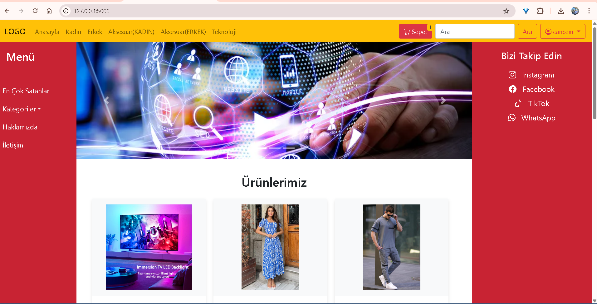
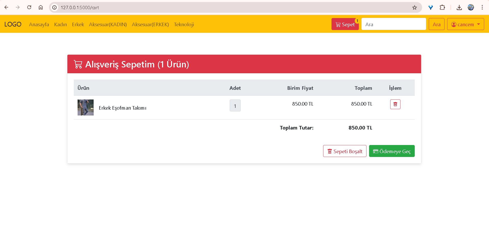
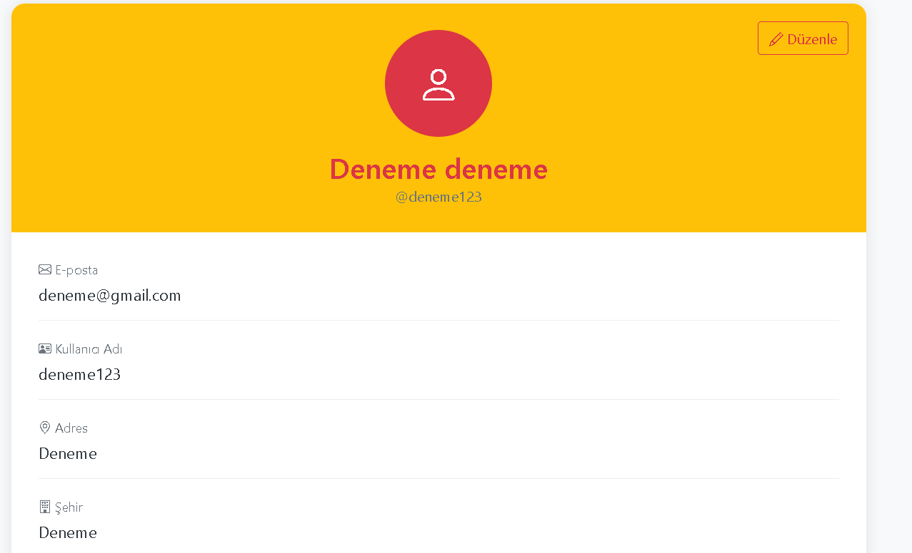

# Flask E-Ticaret Projesi

Bu proje, Flask web framework'ü kullanılarak geliştirilmiş basit bir e-ticaret uygulamasıdır.

## Özellikler

- Kullanıcı kaydı ve girişi
- Ürün listeleme ve detay görüntüleme
- Sepet yönetimi
- Sipariş oluşturma
- Admin paneli
- Kategori yönetimi
- Bildirim sistemi
- İletişim formu

## Kurulum

1. Projeyi klonlayın:
```bash
git clone [repo-url]
cd [repo-name]
```

2. Sanal ortam oluşturun ve aktifleştirin:
```bash
python -m venv venv
source venv/bin/activate  # Linux/Mac için
venv\Scripts\activate     # Windows için
```

3. Gerekli paketleri yükleyin:
```bash
pip install -r requirements.txt
```

4. Veritabanını oluşturun:
```bash
flask db upgrade
```

5. Uygulamayı çalıştırın:
```bash
python main.py
```

## Kullanım

- Ana sayfa: http://localhost:5000
- Admin paneli: http://localhost:5000/admin/login
- Varsayılan admin bilgileri:
  - Email: admin@example.com
  - Şifre: admin123

## Proje Yapısı

```
├── alembic/           # Veritabanı migrasyonları
├── instance/          # Veritabanı dosyaları
├── migrations/        # Flask-Migrate dosyaları
├── static/            # Statik dosyalar (CSS, JS, resimler)
├── templates/         # HTML şablonları
├── main.py           # Ana uygulama dosyası
├── models.py         # Veritabanı modelleri
├── requirements.txt  # Bağımlılıklar
└── README.md         # Bu dosya
```


## Ekran Görüntüleri

### Ana Sayfa


### Sepet Sayfası


### Profil Sayfası


### İletişim Sayfası

## Lisans

Bu proje MIT lisansı altında lisanslanmıştır. 